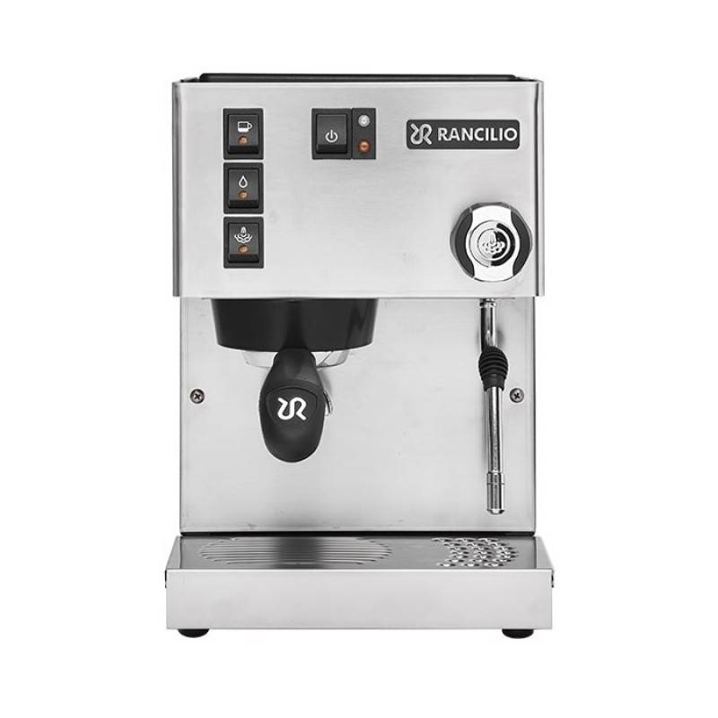

# Daschl's Rancilio Silvia PID Mod

This repository contains my personal, non commercial, [PID](https://en.wikipedia.org/wiki/PID_controller) modification for the [Rancilio Silvia](https://www.ranciliogroup.com/rancilio/silvia/silvia/) espresso machine.

